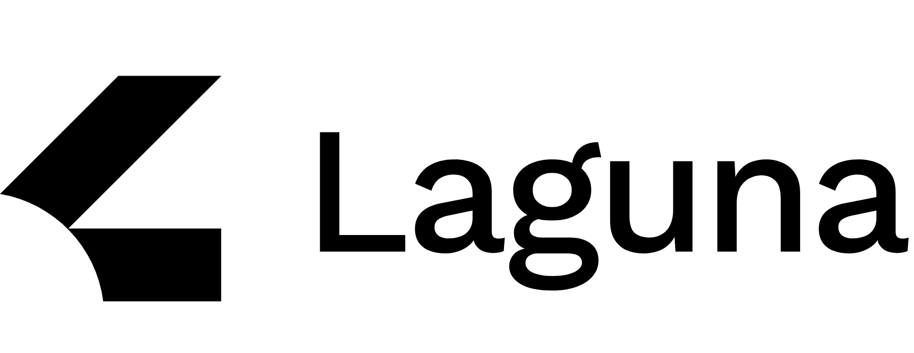
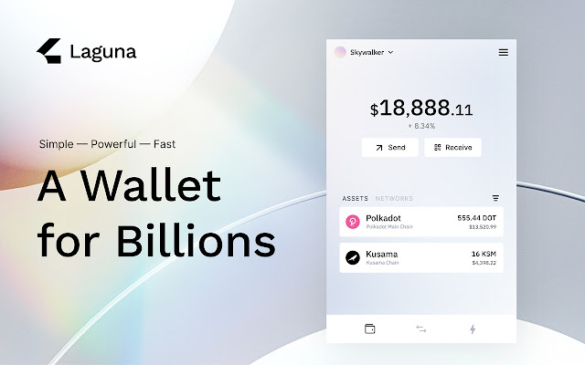

# 

A powerfully simple, open-source wallet that bridges millions of new users to DeFi, Dapps and web3.

#####Non-Custodial
We never have access to your data. Your data, funds and passphrase is stored with you alone.

#####Multi-Chain
We leverage only the highest quality blockchains, utilizing projects that serve our users the best.

#####Private
We do not track or record any identifiable user data so your wealth stored safely away from prying eyes.

#####The Vision
Laguna Labs is a team of consummate builders with a track-record to bringing innovative products to market. We're a global group pedigreed, degen, and populated by those who don't mind grinding — all rolled into one decentralized startup. We're here to make your money life better and beautiful. And we mean it.

## Installation

- On Chrome, install via [Chrome web store](https://chrome.google.com/webstore/detail/laguna-wallet/oomiehgikgjgboniolignjnaflncbamj)

## Development version

Steps to build the extension and view your changes in a browser:

1. Build via `yarn build` or `yarn watch`
2. Install the extension
  - Chrome:
    - go to `chrome://extensions/`
    - ensure you have the Development flag set
    - "Load unpacked" and point to `packages/extension/build`
    - if developing, after making changes - refresh the extension
  - Firefox:
    - go to `about:debugging#addons`
    - check "Enable add-on debugging"
    - click on "Load Temporary Add-on" and point to `packages/extension/build/manifest.json`
    - if developing, after making changes - reload the extension
3. When visiting `https://polkadot.js.org/apps/` it will inject the extension

Once added, you can create an account (via a generated seed) or import via an existing seed.

## Development

### Extension is divided into two separate projects, Background and Popup

Background manages communication with 3rd party APIs and saves data into localStorage. Persistent state - user logged in status, opened keyRings - is stored in memory.

Popup consists of ui components, routing and managing application state, partially grabbed from localStorage.

Communication between background and popup is via [chrome.runtime.sendMessage]

##### Background

On Extension install, background.js will start polling data from APIs.
PRICES_UPDATED
COIN_INFO_UPDATED
ACCOUNTS_BALANCE_UPDATED
TOKEN_DECIMALS_UPDATED

Coin prices and other metadata are grabbed from Coingecko.

Token decimals and account balances are from Subscan.

##### Popup

For routing popup uses [react-chrome-extension-router](https://www.npmjs.com/package/react-chrome-extension-router)

Application uses Redux for state managment, Redux-from for managing complex forms, some of the components use Formik for managing forms.

Formik can be removed altogather, this will be refactored in the future.

## Mnemonics, Passwords, and Imports/Exports

### Using the mnemonic and password from the extension

When you create a keypair via the extension, it supplies a 12-word mnemonic seed and asks you to create a password. This password only encrypts the private key on disk so that the password is required to spend funds or to import the account from backup. The password does not protect the mnemonic phrase. That is, if an attacker were to acquire the mnemonic phrase, they would be able to use it to spend funds without the password.